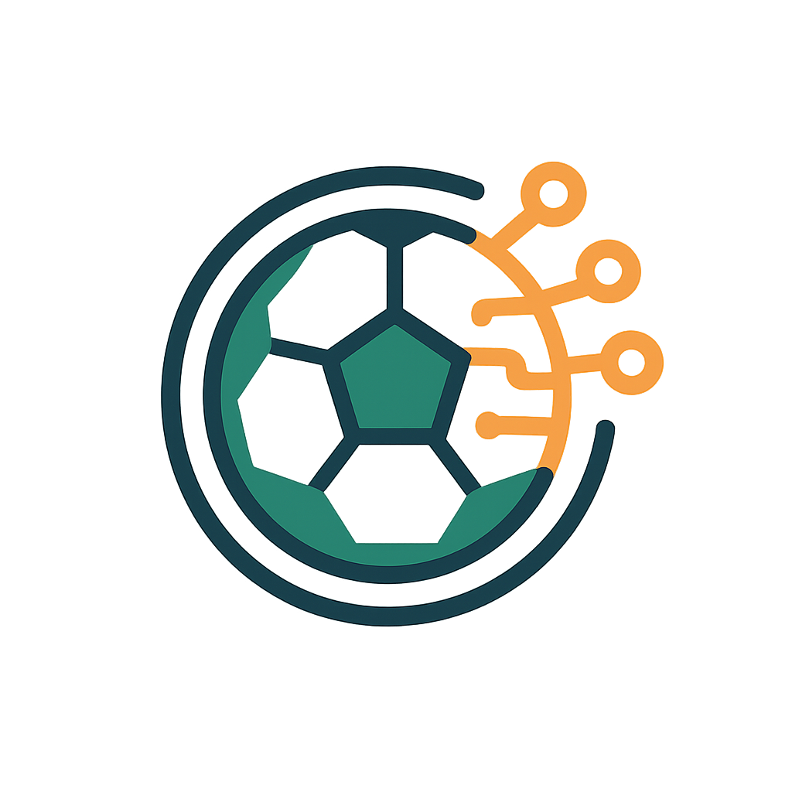

# SmartCoach AI 




### 🧠 SmartCoach AI (Entrenador deportivo con IA)
- 🏋️ Entrenamiento personalizado
- 🍎 Consejos de alimentación
- 🧘 Recuperación física
- 🤖 Recomendaciones generadas con **Gemini (Google AI)**

Aplicación Flutter que solicita datos de un jugador, usa **Gemini (Google)** para generar recomendaciones personalizadas (entrenamiento, alimentación y recuperación) y muestra los resultados.

> ⚠️ Importante: la respuesta de la IA es informativa y puede contener errores. No reemplaza el consejo de un entrenador profesional.

## Requisitos
- Flutter (sdk de Flutter)
- Conexión a Internet
- **API Key** de Gemini (Google AI Studio / Google Cloud)

## Cómo ejecutar
1) Instala dependencias:
```bash
flutter pub get
```
2) Ejecuta en modo debug (recomendado):
```bash
flutter run
```

## Configurar la API Key
En `lib/services/gemini_service.dart` la clase `GeminiService` usa una `API Key` definida en el código.

Si necesitas cambiarla, edita el valor de:
- `_apiKey` dentro de `GeminiService`.

## Flujo de pantallas
- **WelcomeScreen**: acceso a consentimiento o historial.
- **ConsentScreen**: checkbox obligatorio para continuar.
- **ConsentChoiceScreen**: dos botones: Registro del jugador / Listado de jugadores.
- **RegistrationScreen**: formulario (Nombre, Edad, Posición, Nivel, Objetivo) → llamada a Gemini.
- **ResultsScreen**: muestra las recomendaciones (con indicador de carga durante la solicitud).
- **HistoryScreen**: muestra jugadores guardados en memoria.

## Nota de integración Gemini
El prompt se genera desde `Player.toPrompt()` e incluye los títulos requeridos:
- ANÁLISIS DEL JUGADOR
- RECOMENDACIONES DE ENTRENAMIENTO
- CONSEJOS DE ALIMENTACIÓN
- RECOMENDACIONES DE RECUPERACIÓN FÍSICA

## Problemas comunes
- **503**: Gemini puede estar temporalmente saturado. El servicio implementa reintentos.
- **4xx/404**: revisar modelo/endpoint configurado en `GeminiService`.

