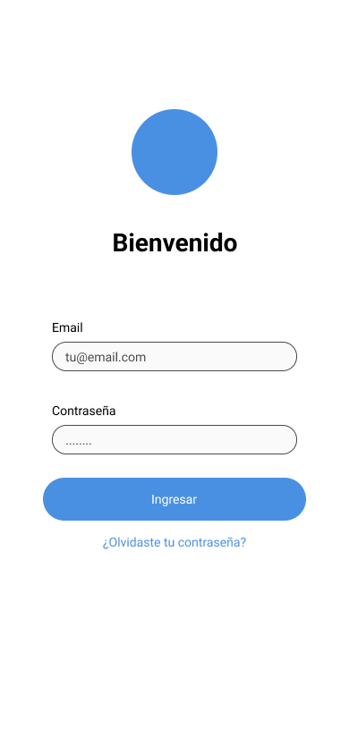
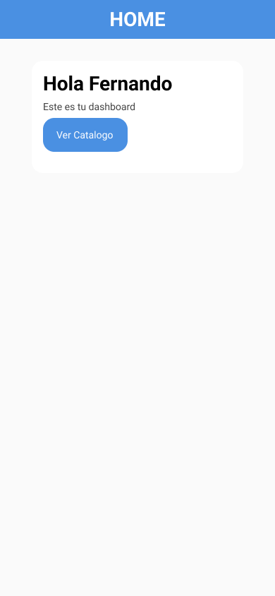
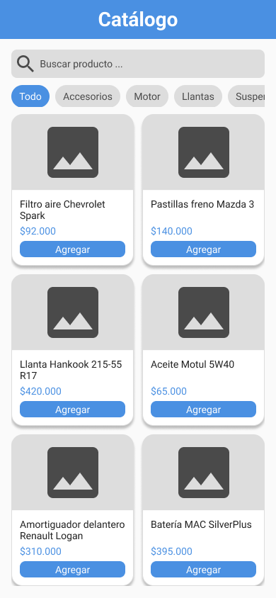

# 📦 Catalogo App
Una aplicación móvil desarrollada con **Flutter** para mostrar un catálogo de productos o ítems.  
Este proyecto sirve como base para una app multiplataforma (Android, iOS y Web) que puede adaptarse a cualquier catálogo.


## Construido con las herramientas y tecnologías:


---

---

## 👩‍💻 Sobre el proyecto

**Catalogo App** es una aplicación móvil desarrollada con **Flutter**, diseñada para mostrar un catálogo de productos de forma clara, moderna y escalable.

Este proyecto forma parte de mi **portafolio personal**, y demuestra el uso de Flutter para crear aplicaciones **multiplataforma** con una base sólida y buenas prácticas.

---

## 🎯 Objetivo

- Practicar desarrollo móvil con Flutter
- Construir una estructura base reutilizable para apps de catálogo
- Aplicar principios de UI/UX y organización de código
- Preparar el proyecto para futuras integraciones (API, base de datos, autenticación)

---
## 📁 Estructura del Proyecto

```md
CATALOGO_APP    /
│
├── .dart_tool/
├── .idea
├── android
├── assets
├── build
├── ios
├── lib
│   ├── screens/
│   │   ├── catalogo.dart
│   │   ├── home.dart
│   │   └── login.dart
│   │   
│   ├── utils/
│   │   ├── constants.dart
│   │   └── validators.dart
│   │   
│   └── main.dart ← punto de entrada
│
├── linux/
├── macos/
├── test/
├── web/
├── windows/
│
├── .gitignore
├── .metadata
├── analysis_options.yaml
├── catalogo_app.iml
├── pubspec.lock
├── pubspec.yaml
└── README.md ← este archivo
```

----
## ⚙ Instalación

1.  Clonar repositorio:
    ```md
    git clone https://github.com/tatiana1104/catalogo_app.git
    ```
2.  Accede al proyecto:
    ```md
    cd catalogo_app
    ```
3.  Instala las dependencias:
    ```md
    flutter pub get
    ```
4.  Ejecuta la aplicación:
    ```md
    flutter run
    ```
----

## 📸 Capturas de pantalla

El diseño de la interfaz de usuario fue creado en **Figma**.

🔗 Ver diseño:  https://www.figma.com/design/Ru9f2BlxN211IUez42GBlV/Catalogo-de-productos?node-id=5-38&m=dev&t=04Ngr0jKjzgWfC4u-1

A continuación se muestran algunas vistas de la aplicación **Catalogo App**:

<p align="center">
  
  
  
</p>